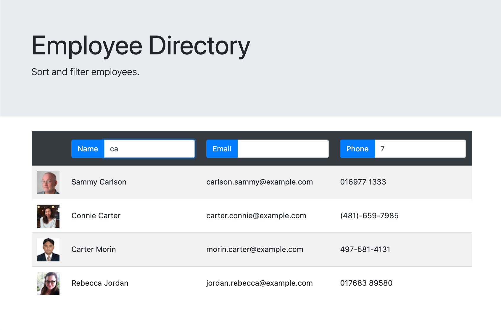

# employee-directory
[](http://unlicense.org/)

## Description

This page displays a list of employees and allows you to filter them by name, email, or phone number. You can also sort by each of those columns as well.

## Table of Contents

* [Installation](#installation)

* [Usage](#usage)

* [License](#license)

* [Contributing](#contributing)

* [Links](#links)

* [Questions](#questions)

## Installation

To install the necessary dependencies, run the following command:

```
npm install
```

## Usage

Once you run `npm install`, you should be able to run `npm start` to run the app locally.

## Screenshot



## License

This project is licensed under the None license.

## Contributing

Send me a PR if you're brave.

## Links

* [GitHub Repository](https://github.com/zackapotamus/employee-directory)

* [Deployed Page](https://zackapotamus.github.io/employee-directory/)

## Questions


If you have any questions about the repo, open an issue or contact [zackapotamus](https://api.github.com/users/zackapotamus) at [zack.hayden@gmail.com](mailto:zack.hayden@gmail.com).

